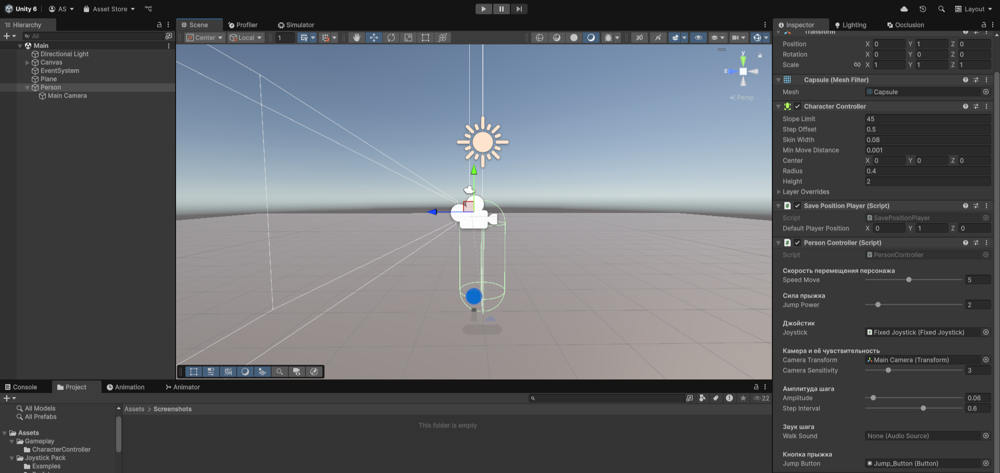

# CharacterMoveController

**Unity Version:** 2022.3+ (совместимость с Unity 6) 

## Описание

Данный контроллер предназначен для управления игровым персонажем с помощью сенсорного экрана.

## Особенности

- Удобное управление через виртуальный джойстик
- Сохранение последней позиции персонажа

## Оптимальные настройки

  

## Assets
Контроллер разработан с использованием ассета [Joystick Pack](https://assetstore.unity.com/packages/tools/input-management/joystick-pack-107631) из Unity Asset Store.

## Установка
1. Импортируйте Joystick Pack в свой проект
2. Добавьте контроллер на вашего персонажа
3. Настройте параметры